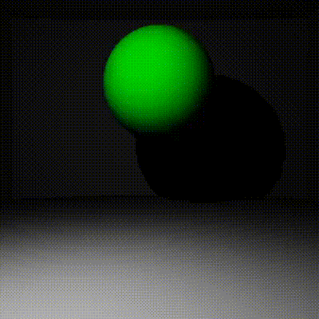

# Raytracer

Raytracer built upon [this course (number II)](https://perso.liris.cnrs.fr/nicolas.bonneel/ENS.html).

Render images of the scenes you create in [main file](https://github.com/devmlGit/Raytracer/blob/6575699a04a688d8eb9c28f1f75fd2b8310e60ec/main.py). For the moment, only diffuse materials and spheres are available.
